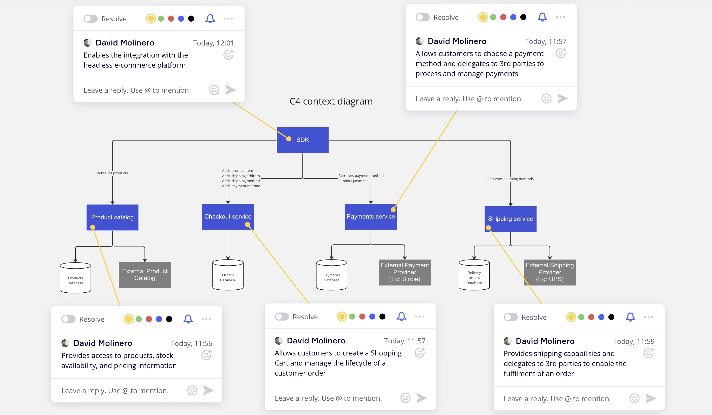
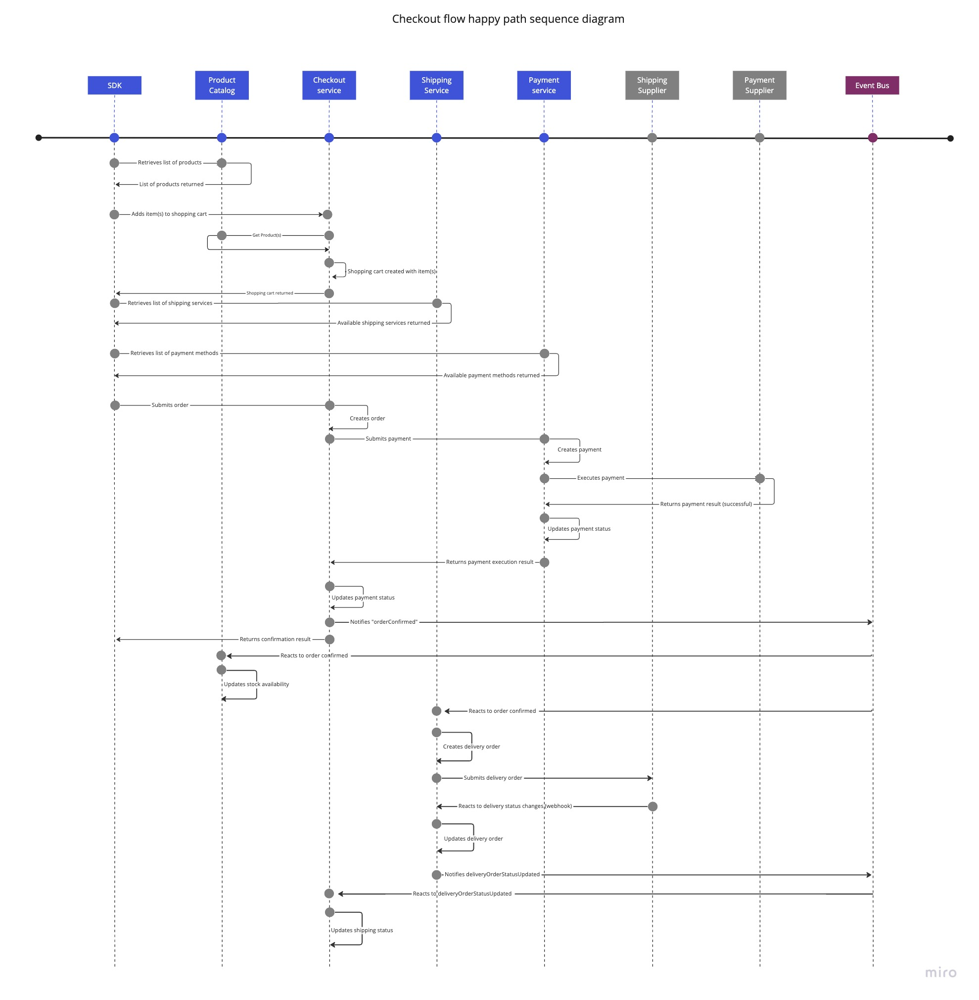

### C4 Context diagram

### Checkout flow (simplified happy path) sequence diagram

### Implementation notes and assumptions

- I've decided to use an HTTP REST API for this set of services over other implementation approaches such as a GraphQL
  based API since having high levels of flexibility for querying these systems doesn't seem to be a key requirement
  with the limited information about current use-cases. An HTTP based integration for an SDK will reduce the number of
  libraries and dependencies that have to be bundled in the client library, however a GraphQL based API would be a
  valid alternative and possibly a better choice depending on different scenarios. A better understanding of the use
  cases would help to make a more informed decision about the right choices
- API payloads mean to be illustrative and are very basic, they would have to be extended in a real world scenario
- Depending on the checkout flow, a different set of APIs might become useful to update multiple related properties of 
  the shopping cart in one call like providing the Shipping method and the Shipping address at once, in situations like
  this, a GraphQL based API would have some advantages and be more flexible in terms of offering different checkout 
  flows
- I've assumed it is OK to use asynchronous integrations via an event bus for activities that can happen in background
- I've assumed that the payment flow is driven by an in-house payments service but depending on the implementation of
  the external payments provider, the SDK could make direct calls to the payments provider, doing so could have some
  advantages like not having to proxy sensitive credit-card or payment related information
- I've only considered a credit card payment method, if other complex financed payment methods are accepted other
  microservices might have to be considered
- I've assumed the external shipping provider allows an integration via webhooks to notify clients about shipment status
  updates
- Certain infrastructure resources like an API Gateway, an authentication mechanism, observability infrastructure, etc.
  would need to be in place in a production ready implementation

### Other services that might be required

- Depending on the complexity an Order Management Service might have to be extracted out from the checkout service
- A search service might be needed to offer advanced product search capabilities
- An invoice service might be needed to generate invoices for customers, calculate how to split the margin between
  brands, publishers, etc.
- A Customer Relationship Management Service might be needed in order to enable marketing communications with customers
  and customer support queries

### Requirements

- docker
- docker-compose

### API docs

- In the root directory of this project execute `docker-compose up -d` to run the docker containers with the API docs
- Navigate to [localhost:8080](http://localhost:8080) to access Checkout Service API documentation
- Navigate to [localhost:8081](http://localhost:8081) to access Shipping Service API documentation
- Navigate to [localhost:8081](http://localhost:8082) to access Payments Service API documentation
- In the root directory of this project execute `docker-compose down` to stop the docker containers with the API docs

### Other considerations

API endpoints not implemented

- Delete a shopping cart
- Update or delete a shipping method in the shopping cart
- Update or delete a payment method in the shopping cart
- Create, update or delete shipping methods
- Create, update or delete payment methods
- Product catalog API
